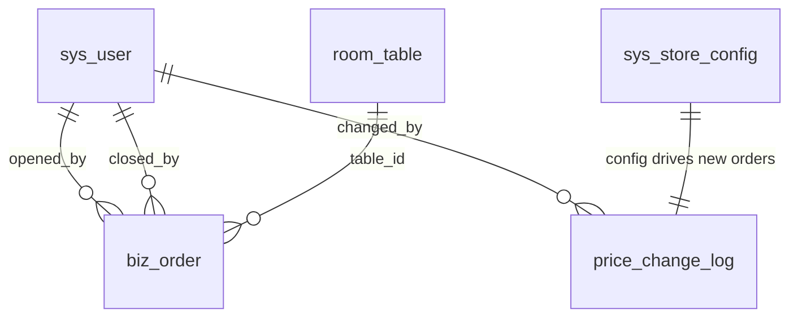

# 棋牌室开单系统 · 数据库脚本

## 执行顺序

### Supabase（当前推荐）

见 [supabase/README.md](supabase/README.md)。在 `code/backend/.env` 配置 `DATABASE_URL` 后运行 `code/setup-db.ps1`，或手动执行 [supabase/01-init-schema.sql](supabase/01-init-schema.sql)。

### MySQL（历史）

在 **DbClient 当前选中的 MySQL 连接** 上依次执行（脚本不指定主机，由插件连接决定）：

| 顺序 | 文件 | 说明 |
|------|------|------|
| 1 | [01-create-database-qipai.sql](01-create-database-qipai.sql) | 创建库 `qipai` 并 `USE` |
| 2 | [02-init-tables.sql](02-init-tables.sql) | 建表 + 初始配置/示例台位 |
| 3 | [03-add-timing-billing.sql](03-add-timing-billing.sql) | 计时/自动计费字段（增量，已有库执行一次） |

## 表一览

| 表名 | 用途 |
|------|------|
| `sys_user` | 账号；角色 CASHIER / MANAGER / SHAREHOLDER / ADMIN |
| `sys_store_config` | 单行全局配置：基准价、收银员改价/导出/报表月数、超管报表天数 |
| `price_change_log` | 基准价修改审计 |
| `room_table` | 台位名称、排序、启用/停用 |
| `biz_order` | 开单订单：快照基准价、实收价、开单/清台人与时间、OPEN/CLOSED |

## 与需求对应

- **一桌一单**：`biz_order` 中 `table_id` + `status='OPEN'` 同时仅一条（应用开单前校验；高版本可加唯一约束方案见脚本注释）。
- **桌台绿/红**：查询 `room_table` 左联是否存在 `status='OPEN'` 的订单。
- **改价仅对新单**：开单时把 `sys_store_config.base_price` 写入 `biz_order.base_price`；历史单不随配置变。
- **有未结单禁止删台**：删除 `room_table` 前检查是否存在 `table_id` 且 `status='OPEN'`。
- **报表**：对 `status='CLOSED'` 按 `closed_at` 聚合 `COUNT(*)`、`SUM(base_price)`、`SUM(actual_price)`；收银员加 `opened_by = 当前用户`。

## ER 关系（简图）

## 部署注意

1. 执行前确认 DbClient 连接是否为**目标环境**（生产/测试）。
2. `02-init-tables.sql` 中含 `DROP TABLE`，**勿在生产已有数据时直接重跑**。
3. 默认 `admin` 的 `password_hash` 为占位符，部署后必须用 bcrypt 等写入真实哈希。
